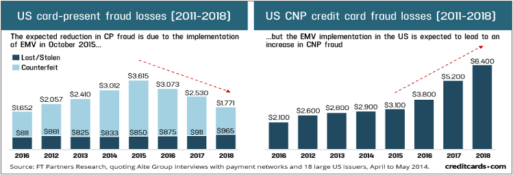

<h1 align="center">Creditcard Fraud Detection using Data Science</h1>

  Chandramouli Yalamanchili  
   Updated - 05/16/2021 [Created - 03/28/2021]
   
  <a href="https://github.com/chandu85/data-science/tree/Portfolio-Design/Project%201%20-%20Creditcard%20Fraud%20detection" target="_blank">
    View Project on GitHub
  </a>

<figure>
    

</figure>  
<!--  -->
 

## Introduction
  We have witnessed an enormous evolution in credit card processing over last few years, issuing chip-based credit cards, starting mobile device-based wallets like Apple Pay is a significant change done to secure credit card transactions.

  Despite financial institutions (banks) working hard to eliminate fraud in credit card transactions, credit card fraud has been continuously rising over the last few years. Fraudsters are getting smarter and using latest technologies to steal cardholder’s information, either through hacking or through social engineering.

  Increasing fraud in the industry makes fraud prediction very critical to be able to identify and stop fraud in real time, and data science plays a significant role in analyzing and being able to predict fraud based on transactional and cardholder information. The scope of this project is to research and identify different types of predictive analysis algorithms available that can be applied to determine and stop fraudulent transactions.

  In this project I have built a DNN (Deep Neural Network) model to identify the fraudulent transaction by passing the transaction features. I have achieved 99% of accurary with the DNN model I have built.  

[back to top](#top)

## Project Motivation
- We currently have multiple fraud detection tools and most of them highly dependent on manual intervention to build and maintain for more efficiency in catching fraud.
- Through this project, I wanted to research and see how data science and machine learning can help in this area to catch the fraud automatically with very less to no need of human supervision.
- Credit card fraud has always been one of the major concerns for financial institutions as it could them financially in term of penalties as well as impact their reputation.
- Being able to detect fraud efficiently in real time with less human support would be a great help for the financial institutions.  

[back to top](#top)

## Domain Introduction
### Credit Card Transactions
  Credit card processing is one of the fast-growing industries due to
  rapid advances in technology and with more and more customers switching to use credit cards instead of cash for purchases. Innovations like mobile wallets provided by Apple, Google, and other major technology firms have played an enormous role in increased usage of credit cards in recent years.  

  On a very high level, credit card transactions can be of two types, **card present**, and the **card not present** transactions. Card present transactions are the transactions from retail stores or gas stations where cardholder is present during the transaction, and that makes fraud a little bit difficult as the fraudster has to either steal the physical card or copy the card details, to create a duplicate card. Fraud in card present transactions has reduced in recent years due to the introduction of chip cards (challenging to copy and reproduce) and increased usage of mobile wallets which have the same security as chip cards. That leaves us with the card not present transactions, where we are seeing an increased number of fraudulent transactions in recent years. These are usually e-commerce or online portal-based transactions. In this case, fraudsters needed very less information about the physical card and cardholder to perform the transactions.  

Fraud transactions can be of different types, below are some examples of fraudulent transaction types:
- **Merchant fraud** - Merchant POS device is compromised and used to run fraudulent transactions.
- **Application Fraud** - Fraudster applying for a new credit card on behalf of the cardholder.
- **Counterfeit Card Fraud** - Usually committed through skimming. Information from the card is stolen and used to create a fake magnetic stripe card with stolen data.
- **Lost/Stolen Fraud** – Transactions are performed using the cards that are either stolen from the cardholder or lost by the cardholder.
- **Not Received as Issued (NRI)** - Fraudsters intercepts the mail and steal the credit cards issued to the cardholder.  

  Any fraudulent transaction will add liability to different parties in the transaction flow like the merchant, merchant processor, networks like Visa/MasterCard, issuing processor, issuing bank and even cardholder depending on who was the weak link for that transaction.  

  Although financial institutions are working hard to eliminate fraud in credit card transactions, it has been continuously rising as fraudsters are using the latest technologies to steal cardholder’s information, either through hacking or through social engineering.   
  
  We can detect these fraudulent transactions by analyzing parameters from different segments of information like transactional information, historical information, etc. Also, considering the liability burden on banks, it is critical to be able to identify these fraudulent transactions in real time.  

[back to top](#top)
### Credit Card Fraud Statistics
  There have been massive data breaches in the past few years, and these data breaches will make cardholder information available to fraudsters, subsequently increasing fraud. Below are some of the well-known data breaches happened in recent years:
- Yahoo data breach in 2016 has impacted 3 billion user accounts.
- Equifax data breach in 2017 has affected close to 150 million users.
- Identity theft has been close to 400,000, during 2012 – 2016.
Below statistics from **Figure 1** shows the change in the trend of the fraudulent transaction from the card present transaction until 2015 to the card not-present transactions after 2015.  
<figure>
    

    <figcaption align="center">Figure 1: This image depicts the trend of reducing fraudulent transaction in card present transactions and increase of fraud using card not present transaction after 2015.</figcaption>
</figure>  

[back to top](#top)
### Conventional Fraud detection applications
  Currently, we have so many fraud prediction applications some of them are rules-based, and some of them are score based. These solutions use transactional and historical information to come up with fraud prediction. Below are a few drawbacks I have noticed with these types of applications:
- Rules-based -	Complex to build and manage the rules, we have seen clients setting up bad rules resulting in false positives impacting cardholders.
-	Score based -	These applications use cardholder’s shopping pattern, distance from the location of the previous transaction, etc. to come up fraud score indicating how risky the transaction is. Primary issue I have noticed with this solution is that a new model would take a minimum of 3 months to be ready for production.
-	Common - Both of the applications are highly dependent on human support who has very good domain knowledge.
-	Common - Some of the fraud prediction applications predict the fraud after the transaction got processed, even though it would stop subsequent fraudulent transactions, cardholder is already impacted for that first fraudulent transaction.

[back to top](#top)
### How data science can help?
  We need a robust fraud detection system that can accommodate all of the complexities involved with credit card transactions like high volume processing, volatility, variety of transactions, and criticality, and be able to consider the vast number of attributes available in transactional or historical data and predict fraudulent transactions with high precision in real time.  
  
  The current solution of static rules-based fraud prediction tools won’t stand a chance before rapidly evolving credit card industry as well as increasing fraud in the industry.  
  
  There are several machine learning algorithms that can be used to implement fraud prediction, in this project I have chosen Deep Neural Network (DNN) to see how much a deep learning machine learning model can help in detecting fraudulent transactions.

[back to top](#top)
## Project Details
### Dataset Details
Below credit card transactions dataset from Kaggle has been used for this project
- Dataset - https://www.kaggle.com/mlg-ulb/creditcardfraud  
**Feature Details:**
-	This dataset has total of 284,807 credit card transactions from September 2013.
-	Out of 248,807, 492 transactions are fraudulent, which accounts for only a 0.172% of positive classes.
-	This dataset has only few columns in clear, rest of the columns have been PCA transformed due to the confidentiality of the data. Below are the details for the columns that are in clear.
-	Time – This feature contains the seconds elapsed between each transaction and the first transaction in the dataset.
-	Amount – This is the unaltered amount field on the transaction record.
- Fraud indicator/Class – This is the response variable that indicates whether a transaction is fraud (1) or not (0).
-	We have 28 features that are PCA transformed due to the data compliance requirements.

[back to top](#top)

### Technology used
- Python 3
- Jupyter Notebook  

[back to top](#top)

### Exploratory Data Analysis
#### 1. Transaction Distribution by fraud indicator  
  I have used the class column to show the distribution of fraud and genuine transactions in the input dataset. As expected the fraudulent transactions are very less in number accounting for only 0.172% of events.
<figure>
    

    <figcaption align="center">Figure 2: Genuine vs. Fraud transactions</figcaption>
</figure>

[back to top](#top)

#### 2. Transaction Distribution by time  
  I have derived the hour of the day by using the elapsed time feature, and by assuming that the transactions were captured starting from mid-night. As per the below chart, I can confirm below two observations are matching with my expectation in general:
- Credit card Transactions are high during day hours.
- Fraudulent Transactions are high during night hours.
<figure>
    

    <figcaption align="center">Figure 3: Genuine vs. Fraud transaction distribution by Time</figcaption>
</figure>  

[back to top](#top)

#### 3. Transaction Distribution by transaction amount  
  I have used amount ranges to understand the distribution of the transactions by the transaction amounts. It seems like overall most of the transactions range from 0 - 100 amount. I was surprised to see considerable number of fraudulent transactions in 100-1000 amount range as well.  
<figure>
    

    <figcaption align="center">Figure 4: Genuine vs. Fraud transaction distribution by Amount</figcaption>
</figure>  

[back to top](#top)

#### 4. Correlation Matrix  
  I have plotted the correlation between different features in the dataset, but I have seen only very few features with some correlation with the target variable, Class in this dataset.  
<figure>
    

    <figcaption align="center">Figure 5: Correlation Matrix showing relationships between different features</figcaption>
</figure>  

[back to top](#top)

### Data Preparation
- I have normalized the amount and time fields to bring them to the range of -1 to +1 to be able to use these two features as input to the neural network.
- I have dropped the existing Amount and Time fields from the dataset as I will be using the normalized features instead.
- I have used sklearn's preprocessing package StandardScaler to standardize the time and amount features.

[back to top](#top)

### Modeling
#### Model Details
- Using Keras, I have built the neural network with 6 layers, including 4 hidden layers.
- Compiled the model using adam optimizer, binary_crossentropy loss parameter, and using the accuracy metric.
- Trained the model using training set for 10 epochs.
- Below is the model summary as showin in figure 6.
<figure>
    

    <figcaption align="center">Figure 6: DNN Model Summary</figcaption>
</figure>  

[back to top](#top)

#### 1. Deep Neural Network trained with imbalanced dataset
- Below as shown in Table 1 are the performance metrics for the DNN model that is trained using imbalanced dataset

Table 1: Model performance with imbalanced data  
<table>
  <thead>
    <tr>
      <th> Evaluation Metric </th>
      <th> Value </th>
    </tr>
  </thead>
  <tbody>
    <tr>
      <td>Loss</td>
      <td>0.45%</td>
    </tr>
    <tr>
      <td>Accuracy</td>
      <td>99.91%</td>
    </tr>
    <tr>
      <td>Accuracy Score</td>
      <td>99.94%</td>
    </tr>
    <tr>
      <td>Precision Score</td>
      <td>83.82%</td>
    </tr>
    <tr>
      <td>Recall Score</td>
      <td>77.55%</td>
    </tr>
    <tr>
      <td>F1 Score</td>
      <td>80.57%</td>
    </tr>
  </tbody>
</table>

- As we can see from the metrics above, even though the accuracy is high, the precision is not that great because of more negative (class=0) samples in the dataset.
- Below shown in figure 7 is the confusion matrix reflecting the similar results.
<figure>
    

    <figcaption align="center">Figure 7: Confusion Matrix for Model trained with imbalanced dataset</figcaption>
</figure>  

- Due to the use of imbalanced dataset, the model has shown the signs of over-fitting, the validation results showed more losses than the training data as shown in figure 8 the accuracy and loss plots.
<figure>
    

      

        
        
      

  
  
  <figcaption align="center">Figure 8: Accuracy and Loss plots for Model trained with imbalanced dataset</figcaption>
</figure>   

[back to top](#top)

#### 2. Deep Neural Network trained with balanced dataset
- For the 2nd expeirment, I have used SMOTE, the data oversampling technique to re-create the training and testing data by making sure both classes are in equal proportions.
- I have also trained the DNN model for higher number of iterations with 50 epochs.
- Below as shown in Table 2 are the performance metrics for the DNN model that is trained using imbalanced dataset

Table 2: Model performance with balanced data  
<table>
  <thead>
    <tr>
      <th> Evaluation Metric </th>
      <th> Value </th>
    </tr>
  </thead>
  <tbody>
    <tr>
      <td>Loss</td>
      <td>0.69%</td>
    </tr>
    <tr>
      <td>Accuracy</td>
      <td>99.88%</td>
    </tr>
    <tr>
      <td>Accuracy Score</td>
      <td>99.88%</td>
    </tr>
    <tr>
      <td>Precision Score</td>
      <td>99.76%</td>
    </tr>
    <tr>
      <td>Recall Score</td>
      <td>100%</td>
    </tr>
    <tr>
      <td>F1 Score</td>
      <td>99.88%</td>
    </tr>
  </tbody>
</table>

- As we can see from the metrics above, the model performance has improved significantly with the balanced dataset.
- Below shown in figure 9 is the confusion matrix reflecting the similar results.
<figure>
    

    <figcaption align="center">Figure 9: Confusion Matrix for Model trained with balanced dataset</figcaption>
</figure>  

- Below as shown in figure 10 the accuracy and loss curves reflects that model is fitting fine with the new sample data.
<figure>
    

      

        
        
      

  
  
  <figcaption align="center">Figure 10: Accuracy and Loss plots for Model trained with balanced dataset</figcaption>
</figure>   

[back to top](#top)

## Future scope
  Once the model is ready, the next big challenge ould be to evaluate options to integrate this model to work with real time transactions coming through to determine and stop the fradulent transactions immediately. I will explore further to evaluate and determine best options to integrate fraud detection model into realtime transaction processing system.

[back to top](#top)

## Acknowledgement
  Thanks to Bellevue University and all professors for the continuous guidance and support through out the data science course. Thanks to Professor Fadi Alsaleem for providing continuous constructive feedback and peers for their valuable inputs and discussions that helped me in building this project.  
  
  I also thank all the authors of the reference papers and articles.  

[back to top](#top)

## Conclusion
  Credit card fraud is a growing concern in today’s world with both credit card usage and credit card fraud on the rise. As shown in the stats, the number of data breaches, identity theft cases, and credit card fraudulent transactions are rising at an alarming level.  
  
  Data science plays a significant role in improving the fraud prediction tools we are currently using, by analyzing credit card transactions and being able to predict fraud based on transactional data, cardholder data, and historical data.  
  
  Machine learning algorithms running on neural networks can be effective as proven in this project and they should replace the current static rules-based fraud detection products to improve the fraud prediction precision and to stay up to speed with market trends in detecting new strategies of fraudsters and stopping them.  
  
  One common issue we will have with credit card transactions is less number of transactions that the number of fraudulent transactions will be very low when compared to the overall transaction volume. So, we have to use the relevant oversampling techniques to be able to train the models efficiently to do a better job at catching fraudulent transactions.  

[back to top](#top)

## References
1.	Chan, P. K., Fan, W., Prodromidis, A. L., & Stolfo, S. J. (1999). Distributed data mining in credit card fraud detection. IEEE Intelligent systems, (6), 67- 74. Retrieved from https://cs.fit.edu/~pkc/papers/ieee-is99.pdf.
2.	Brause, R., Langsdorf, T., & Hepp, M. (1999). Neural data mining for credit card fraud detection. In Proceedings 11th International Conference on Tools with Artificial Intelligence(pp. 103-106). IEEE. Retrieved from http://sphinx.rbi.informatik.uni-frankfurt.de/asa/papers/ICTAI99.pdf.
3.	Ghosh, S., & Reilly, D. L. (1994, January). Credit card fraud detection with a neural-network. In System Sciences, 1994. Proceedings of the Twenty- Seventh Hawaii International Conference on (Vol. 3, pp. 621-630). IEEE. Retrieved from http://bit.csc.lsu.edu/~jianhua/quang.pdf.
4.	Chan, P. K., & Stolfo, S. J. (1998, August). Toward Scalable Learning with Non-Uniform Class and Cost Distributions: A Case Study in Credit Card Fraud Detection. In KDD (Vol. 98, pp. 164-168). Retrieved from https://www.aaai.org/Papers/KDD/1998/KDD98-026.pdf.
5.	Maes, S., Tuyls, K., Vanschoenwinkel, B., & Manderick, B. (2002, January). Credit card fraud detection using Bayesian and neural networks. In Proceedings of the 1st international naiso congress on neuro fuzzy technologies (pp. 261-270). Retrieved from https://arxiv.org/pdf/1908.11553.pdf.
6.	Masoumeh Zareapoor, & Pourya Shamsolmoali (2015). Application of Credit Card Fraud Detection: Based on Bagging Ensemble Classifier. Procedia Computer Science (Vol. 48, pp. 679-685). https://doi.org/10.1016/j.procs.2015.04.201. Retrieved from https://cyberleninka.org/article/n/324468.pdf.
7.	Stolfo, S., Fan, D. W., Lee, W., Prodromidis, A., & Chan, P. (1997, July). Credit card fraud detection using meta-learning: Issues and initial results. In AAAI-97 Workshop on Fraud Detection and Risk Management. Retrieved from https://www.aaai.org/Papers/Workshops/1997/WS-97-07/WS97-07-015.pdf.
8.	Luke Sun (July 2020). Credit Card Fraud Detection. Retrieved from https://towardsdatascience.com/credit-card-fraud-detection-9bc8db79b956
9.	Dorronsoro, J. R., Ginel, F., Sgnchez, C., & Cruz, C. S. (1997). Neural fraud detection in credit card operations. IEEE transactions on neural networks, 8(4), 827-834. Retrieved from 	https://repositorio.uam.es/bitstream/handle/10486/663701/neural_dorronsoro_ITNN_1997_ps.pdf;jsessionid=28C549CC8D6DFFC1AB4F2A16D511F89F?sequence=1.
10.	Sánchez, D., Vila, M. A., Cerda, L., & Serrano, J. M. (2009). Association rules applied to credit card fraud detection. Expert systems with applications, 36(2), 3630-3640. Retrieved from http://didawiki.cli.di.unipi.it/lib/exe/fetch.php/dm/ar-creditcard-fraudedetection.pdf.
11.	Brian Fung March 2018, Equifax’s massive 2017 data breach keeps getting worse. Retrieved May 16, 2019 from https://www.washingtonpost.com/news/the-switch/wp/2018/03/01/equifax-keeps-finding-millions-more-people-who-were-affected-by-its-massive-data-breach/?noredirect=on&utm_term=.0b854d8c3526

[back to top](#top)
