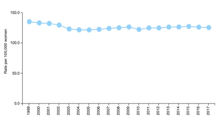
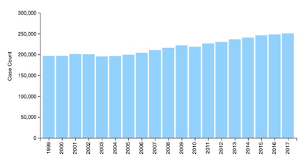

<h1 align="center">Breast Cancer Classification using Computer Vision</h1>

  Chandramouli Yalamanchili  
   Updated - 06/03/2021 [Created - 03/28/2021]
   
  <a href="https://github.com/chandu85/data-science/tree/main/Project%202%20-%20Breast%20Cancer%20Classification%20using%20Computer%20Vision" target="_blank">
    View Project on GitHub
  </a>

<figure>
    

</figure>  
 

## Introduction
Breast cancer is one among the foremost common forms of cancer in American women, it’s estimated that within the year of 2020, approximately 30% of the new cancer diagnosed women are carcinoma. Within Carcinoma, the Invasive Ductal Carcinoma (IDC) is the frequent subcategory. Within the year of 2020, IDC subtype accounted for 85% of total carcinoma cases.  

Usually, pathologists look for the regions within the full mount sample that have IDC to come up with grade for the whole sample. As a result, one of the critical pre-processing steps is to define the precise regions of IDC within an entire mount slide. Using the automatic process to evaluate each of the patches or the mount samples would be great help in saving time and increasing the accuracy of the diagnosis.  

Through this project we have built a Keras based CNN (Convolutional Neural Network) classifier model that would evaluate the patches collected from several whole mount slide images and accurately classify a histology image as benign or malignant.  

[back to top](#top)

## Project Motivation
- Breast cancer is the most common type of cancer in women, in 2020, 276,480 new cases were estimated to be diagnosed with invasive breast cancer and 48,530 non-invasive breast cancer cases were estimated.
- Invasive ductal carcinoma (IDC) is the most common form of breast cancer.
- As one can imagine, accurately identifying and categorizing breast cancer subtypes is an important clinical task. Using the automated methods in categorizing the breast cancer subtype can be of great help in saving time as well as reducing incorrect diagnosis.
- Through this project I would like to understand how deep learning based computer vision can help in diagnosing a certain type of cancer efficiently and accurately.

[back to top](#top)

## Domain Introduction
### Breast Cancer Introduction
Breast cancer occurs mostly in women, it is a type of the cancer where the breast cells start to grow abnormally.  In the case of breast cancer, a tumor is formed by the cancer cells, these tumors can be examined x-ray or can be felt with touch as a lump. The lumps formed in the breast can either be benign or malignant. Benign, the non-cancerous tumors are usually not life threatening as they grow slowly and do not spread to other parts of the body. Whereas malignant tumors are the cancerous cells, they are considering life threatening as they grow rapidly, they also attack and kill the nearby tissues, as well as spread throughout the body.  

On a very high level, breast cancer can be of different types like invasive, non-invasive, metastatic, intrinsic, and molecular. For this version, we have considered the specific type of cancer that is Invasive Ductal Carcinoma (IDC) subtype of breast cancer. This type of cancer constitutes to 80% of the breast cancer cases.  

<figure>
    

        
        
    

    <figcaption align="center">Figure 1: Picture showing the invasive Ductal Carcinoma (IDC). Showing the abnormal growth in the enlarged cell within the duct.</figcaption>
</figure>  
 
As shown in Figure 1, in case of IDC, the cancer would break through the duct cell’s membrane and invade or spread to the nearby tissues. In this case the cancer would start in ductal tissue of the breast, duct is the tube that connects the lobules to the nipple. Carcinoma is the type of cancer that starts in the tissue that covers the internal organs, like breast cell in this case. If not detected early, invasive ductal carcinoma can invade the other tissues within breast or even other parts of the body.  

Even though invasive ductal carcinoma is most common in older women, it can still affect younger women as well as men. Early detection of the breast cancer will help in increasing the survival rates of the patients. Currently the histopathologists diagnose the tissues extracted from the suspicious tumors and provide information related to type of cancer, and its grade when the tumor tests to be malignant. Data science can help in evaluating the suspected tumor tissues through an automated computer vision workflow and provide the diagnosis along with grade there by saving time as well increasing the accuracy of the diagnosis.  

### Breast Cancer Statistics

<figure>
    

        
        
    

    <figcaption align="center">Figure 2: Chart showing the annual rates of new cancer cases on the left, and the chart showing the annual number of new cancer cases on the right.</figcaption>
</figure>  
 
As we can see in Figure 2, the rates for new breast cancer cases as the number of breast cancer cases over the years has not been coming down. Below are some of the stats for breast cancer in 2020 to put some perspective around the seriousness of the issue:
- 276K women are estimated to be diagnosed with breast cancer in 2020. 
- 42K women are estimated to die from breast cancer in the year 2020.
- 2K men are estimated to be diagnosed with breast cancer in 2020.
- 81% of breast cancer diagnosis are invasive. 

[back to top](#top)

## Project Details
### Dataset Details
Dataset Link - <a href="https://www.kaggle.com/paultimothymooney/breast-histopathology-images/" target="_blank">https://www.kaggle.com/paultimothymooney/breast-histopathology-images/</a>    
•	This dataset is the collection of 277,524 patch images, these patch images were extracted from 162 complete breast cancer specimen images that are captured with 40x magnification.
•	Out of these 277k sample images collection, 198K images are samples of negative samples indicating non breast cancer patches, and 78K images are samples of positive samples diagnosed as impacted by breast cancer.
•	IDC (Invasive Ductal Carcinoma) is the type of cancer that these patches are classified against.
•	Each patch or image file in this dataset is segregated into several folders based on the complete patient id. Within each folder, the images are again segregated by the class of the patch depending on whether it is classified as IDC or not. 
•	Each individual image follows a specific file name formatting as well:
o	uxXyYclassC.png is the format being used for file name.
o	‘u’ is the patient ID
o	‘X’ is the x-coordinate of where the particular patch image was copied from. 
o	‘Y’ is the y-coordinate of where the particular patch image was copied from.
o	‘C’ indicates the classification, where 0 indicates non-IDC and 1 indicates IDC.
o	10253idx5x1351y1101class0.png is an example patch image file name.

[back to top](#top)

### Technology used
- Python 3
- Jupyter Notebook  

[back to top](#top)

### Exploratory Data Analysis
#### 1. IDC dataset statistics
- As shown in Table 1 below, we have the details for 279 patients in the IDC dataset. For 279 patients, the whole mounts have been split into total of 277K patch images.
- Out of all the images we have 198, 738 images are benign cells, meaning non-cancerous. Whereas 78,786 images are malignant cells, meaning cancerous cells. Only 28% of the images are malignant cells resulting in imbalanced dataset.

Table 1: Table with critical statistics from the IDC dataset.  
<table>
  <thead>
    <tr>
      <th> Parameter </th>
      <th> Value </th>
    </tr>
  </thead>
  <tbody>
    <tr>
      <td>Number of patients</td>
      <td>279</td>
    </tr>
    <tr>
      <td>Total number of images</td>
      <td>277,524</td>
    </tr>
    <tr>
      <td>Number of benign cells</td>
      <td>198,738</td>
    </tr>
    <tr>
      <td>Number of malignant cells</td>
      <td>78,786</td>
    </tr>
  </tbody>
</table>

[back to top](#top)

#### 2. Distribution of data by diagnosis
- Figure 3 shows a quick bar chart to reflect the distribution of different classes we have in this dataset.  

<figure>
    

        
    

    <figcaption align="center">Figure 3: Bar Chart showing the distribution of different diagnosis classes in the IDC dataset.</figcaption>
</figure>  

[back to top](#top)

#### 3. Histology images
- Figure 4 below depicts the benign and malignant cell images from the IDC dataset. We have randomly selected 5 patients and showed one benign cell and one malignant cell for each of those 5 patients.   Benign cells have the diagnosis value of 0, and malignant cells have the diagnosis value of 1. 

<figure>
    

        
    

    <figcaption align="center">Figure 4: Benign and Malignant cells for 5 random patients.</figcaption>
</figure>  

[back to top](#top)

### Data Preparation
- As established in EDA section, the dataset is highly imbalanced with only 28% of images belonging to benign class. We have used the class weights option as part of Keras CNN model to overcome this issue.
- We ran into an issue with CPU constraints in working with 2.5 GB worth of images, so we have split the images for modeling by selecting the sample data with limited number of patients for modeling.
- We have used Keras ImageDataGenerator function to generate the data that is used for model training and testing.

[back to top](#top)

### Modeling
#### Model Details
We have built a multi-layer Convolutional Neural Network (CNN) using Keras to perform image classification on the IDC dataset. Below are additional details about the model and its performance.
- We have built 31 layered CNN deep neural network model that would accept the 50x50 images and resolve into the two output classifications.
- We have compiled the model using Adagrad optimizer with initial learning rate of 0.01 and using the decay parameter.
- We have used 20 Epochs to train the model, we could only run 20 Epochs due to the limited CPU resources at my exposure.
- We have evaluated the model using the history parameters returned from the model training, as well as by running the prediction tests on the model that is trained.
- As shown in Table 2, model has achieved 88% accuracy in predicting the cancer cells accurately.  

#### Model Performance
Table 2: Model performance with balanced data  
<table>
  <thead>
    <tr>
      <th> Evaluation Metric </th>
      <th> Value </th>
    </tr>
  </thead>
  <tbody>
    <tr>
      <td>Accuracy</td>
      <td>88%</td>
    </tr>
    <tr>
      <td>Precision Score</td>
      <td>73%</td>
    </tr>
    <tr>
      <td>Recall/Sensitivity Score</td>
      <td>74%</td>
    </tr>
    <tr>
      <td>F1 Score</td>
      <td>74%</td>
    </tr>
    <tr>
      <td>Specificity</td>
      <td>74%</td>
    </tr>
  </tbody>
</table>

- Overall, the model seems to have performed good, but the recall and specificity values are low indicating the model is only 74% accurate in identifying true positives and true negatives.
- Also, from the accuracy and loss plots as show in Figure 5, we can see that the model is overfitting as the validation loss is not quite following the training loss and it’s going high even after 20 Epochs.

<figure>
    

      

        
        
      

  
  
  <figcaption align="center">Figure 5: Accuracy and Loss plots for CNN Model. </figcaption>
</figure> 
 
- Figure 6 also depicts the confusion matrix from the prediction results of the model, showing 74% of accurate cancer prediction results (TN).
- Training the model with more data and for more iterations would probably further improve the model’s performance in predicting cancer accurately.
<figure>
    

        
    

    <figcaption align="center">Figure 6: Confusion Matrix.</figcaption>
</figure>  

[back to top](#top)

## Future scope
There has been a substantial process made in the research of computer vision and image classification in last few decades. Due to the progress made in the field, these techniques are being used in health care or medical imaging domain as well to achieve faster and more accurate results by automating some of the diagnosis steps. It is impressive to learn that when sufficient data is provided to train the model, the results are at par or in some cases exceed the manual evaluation performed by physicians.   

Convolution Neural Networks (CNNs) seems to be the popular solution for computer vision in general or in case of healthcare. These models are being used by several companies that are working towards AI in medical imaging. It is interesting to learn that some of studies and projects are also working with 3D images or AR (Augmented Reality) using the computer vision technology.

[back to top](#top)

## Acknowledgement
Thanks to Bellevue University and all professors for the continuous guidance and support through out the data science course. Thanks to Professor Fadi Alsaleem for providing continuous constructive feedback and peers for their valuable inputs and discussions that helped me in building this project.  
  
  I also thank all the authors of the reference papers and articles.  

[back to top](#top)

## Conclusion
Breast cancer is an increasing concern in today’s world, it is one among the foremost common forms of cancer in American women. Within breast cancer, Invasive Ductal Carcinoma (IDC) is the most common category, accounting for 85% of all carcinoma cases.  

There has been substantial progress made in the computer vision and image classification technology over last few decades, making it possible to use these techniques in healthcare domain for medical imaging and diagnosis. Any contributions the computer vision technology can add in early detection of breast cancer would help in reducing the mortality rate of cancer patients every year.  

In this paper we have taken the histology images of the IDC patient tissues and used them to train Keras based Convolutional Neural Network (CNN) to be able to predict if a particular histology image is benign or malignant. We have established that the CNN model has done a good job in predicting the classification of histology images with 88% accuracy score. We believe using the additional training data and allowing more time for training the model would yield even better prediction accuracy.

[back to top](#top)

## References
1.	F. Milletari, N. Navab and S. Ahmadi, "V-Net: Fully Convolutional Neural Networks for Volumetric Medical Image Segmentation," 2016 Fourth International Conference on 3D Vision (3DV), Stanford, CA, USA, 2016, pp. 565-571, doi: 10.1109/3DV.2016.79. Retrieved May 9, 2021 from https://arxiv.org/pdf/1606.04797.pdf 
2.	Junfeng Gao, Yong Yang, Pan Lin, Dong Sun Park, "Computer Vision in Healthcare Applications", Journal of Healthcare Engineering, vol. 2018, Article ID 5157020, 4 pages, 2018. https://doi.org/10.1155/2018/5157020. Retrieved May 9, 2021 from https://www.hindawi.com/journals/jhe/2018/5157020/ 
3.	Nadim Mahmud, Jonah Cohen, Kleovoulos Tsourides, Tyler M. Berzin, Computer vision and augmented reality in gastrointestinal endoscopy, Gastroenterology Report, Volume 3, Issue 3, August 2015, Pages 179–184, https://doi.org/10.1093/gastro/gov027. Retrieved May 9, 2021 from https://academic.oup.com/gastro/article/3/3/179/613495 
4.	Esteva, A., Chou, K., Yeung, S. et al. Deep learning-enabled medical computer vision. npj Digit. Med. 4, 5 (2021). https://doi.org/10.1038/s41746-020-00376-2. 
Retrieved May 9, 2021 from https://www.nature.com/articles/s41746-020-00376-2
5.	J. Thevenot, M. B. López and A. Hadid, "A Survey on Computer Vision for Assistive Medical Diagnosis From Faces," in IEEE Journal of Biomedical and Health Informatics, vol. 22, no. 5, pp. 1497-1511, Sept. 2018, doi: 10.1109/JBHI.2017.2754861. Retrieved May 9, 2021 from https://www.researchgate.net/publication/320250581_A_Survey_on_Computer_Vision_for_Assistive_Medical_Diagnosis_From_Faces
6.	Chaohui Wang, Nikos Komodakis, Nikos Paragios. Markov Random Field Modeling, Inference & Learning in Computer Vision & Image Understanding: A Survey. Computer Vision and Image Understanding, Elsevier, 2013, 117 (11), pp.1610-1627. ff10.1016/j.cviu.2013.07.004ff. ffhal-00858390v2f. Retrieved May 9, 2021 from
https://hal.archives-ouvertes.fr/hal-00858390/document
7.	Tim F. Cootes and Christopher J. Taylor "Statistical models of appearance for medical image analysis and computer vision", Proc. SPIE 4322, Medical Imaging 2001: Image Processing, (3 July 2001); https://doi.org/10.1117/12.431093. Retrieved May 9, 2021 from https://www.spiedigitallibrary.org/conference-proceedings-of-spie/4322/0000/Statistical-models-of-appearance-for-medical-image-analysis-and-computer/10.1117/12.431093.pdf
8.	Sultana, F., Sufian, A., & Dutta, P. (2018, November). Advancements in image classification using convolutional neural network. In 2018 Fourth International Conference on Research in Computational Intelligence and Communication Networks (ICRCICN) (pp. 122-129). IEEE. Retrieved May 9, 2021 from https://arxiv.org/pdf/1905.03288.pdf
9.	O’Mahony, N., Campbell, S., Carvalho, A., Harapanahalli, S., Hernandez, G. V., Krpalkova, L., ... & Walsh, J. (2019, April). Deep learning vs. traditional computer vision. In Science and Information Conference (pp. 128-144). Springer, Cham. Retrieved May 9, 2021 from 
https://arxiv.org/pdf/1910.13796.pdf
10.	Data-flair-training python projects. Project in Python – Breast Cancer Classification with Deep Learning. Retrieved May 9, 2021 from https://data-flair.training/blogs/project-in-python-breast-cancer-classification/
11.	Breast cancer statistics 2020. Retrieved May 9, 2021 from https://www.nationalbreastcancer.org/wp-content/uploads/2020-Breast-Cancer-Stats.pdf 
12.	What is Breast Cancer? Retrieved May 9, 2021 from https://www.cancer.org/cancer/breast-cancer/about/what-is-breast-cancer.html
13.	United States Cancer Statistics. Retrieved May 9, 2021 from https://gis.cdc.gov/Cancer/USCS/DataViz.html
14.	Invasive Ductal Carcinoma (IDC). Retrieved May 9, 2021 from https://www.breastcancer.org/symptoms/types/idc

[back to top](#top)