
<h1 align="center">IMDB Movie Review Sentiment Analysis</h1>

  Chandramouli Yalamanchili  
   Updated - 06/03/2021 [Created - 03/28/2021]
   
  <a href="https://github.com/chandu85/data-science/tree/main/Project%203%20-%20IMDB%20Movie%20Review%20Sentiment%20Analysis/Code" target="_blank">
    View Project Code on GitHub
  </a>

<figure>
    
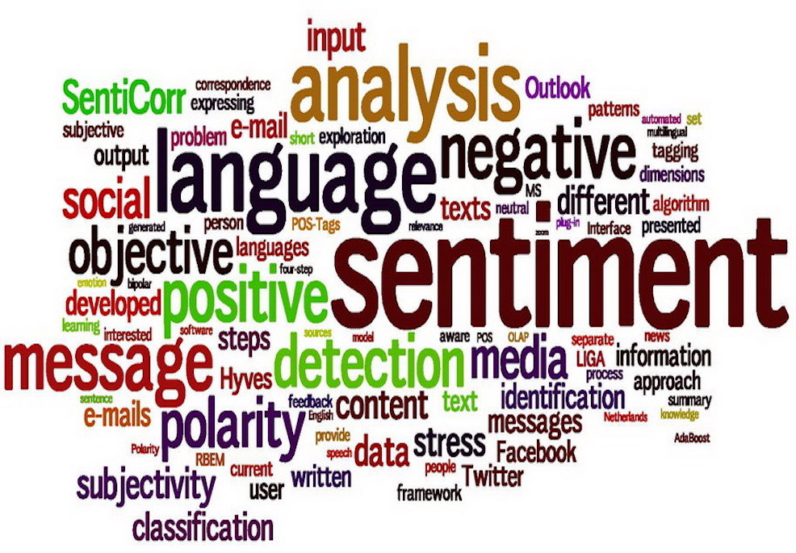

</figure>  
 

## Introduction
Natural Language Processing (NLP) helps the machines to understand the human language, it is a component of artificial intelligence. NLP helps machines to understand the text data that can come from many sources and is unstructured in nature. Great progress has been made in last few decades in NLP domain mainly because of increased computing capabilities, we see NLP being implemented in lot of applications around us through several smart home devices and chat bots.  
Sentiment analysis is an NLP technique that is used to determine the emotion attached to the textual data that generally represents the comments from humans. Sentiment analysis is playing a key role in several enterprises already by enabling the automation in the area of analyzing the customer reviews and feedbacks there by attaining the customer feedback much quicker and being able to make decisions for future products faster while meeting the customer demands.  
Through this project we have used BERT models to perform the sentiment analysis, a subfield of NLP using the IMDB movie reviews dataset. We have also used BERT model for preprocessing step to convert the plain text input into the input formats expected by BERT.  

[back to top](#top)

## Project Motivation
- NLP, natural language processing is one of the fastest growing areas of AI in the recent history, this technology is coming much closer to our life’s day by day. We are seeing more and more call centers and IVR systems started using NLP to interpret the natural responses of the customers instead of having to use the dial pads.
- Sentimental analysis is a use case for NLP, where we will use machine learning algorithms to analyze the natural language in terms of words and classify the text as either positive or negative sentiment.
- Sentiment analysis is playing a key role in automating several areas in enterprises starting from product responses, agent monitoring, sentiment aware chat bots, employee satisfaction, etc.
- Considering the future possibilities, I see in both NLP and sentiment analysis, I want to spend time through this project to gain more understanding on how to analyze the unstructured data in the form of raw text and come up with insights with respect to sentiment by applying NLP machine learning techniques.  

[back to top](#top)

## Domain Introduction
### Natural Language Processing (NLP)
Natural Language Processing (NLP) is a subfield of AI that works with the unstructured form of human language as plain text and come up with critical insights. NLP is the field of AI that makes it possible for machines to interact with humans through several means while accepting text inputs, interpreting the text inputs, and then responding back with the meaningful and helpful answers. Gmail would serve as a great example on how well NLP helps in organizing our day-to-day life. Gmail automatically organizes the emails depending on the content, it also provides alerts around the travel/bill pay timelines depending on emails we have received in that context.  
Enormous amount of data is being generated every second from different sources, especially due to the immense growth in the social media platforms. Most of this data being generated in unstructured in nature and that’s where NLP plays a key role in adding intelligence to this data and extracting valuable insights from this data that can help shaping the better future.   
Showcased in Figure 1 below are a few of many use cases for NLP.  
<figure>
    

        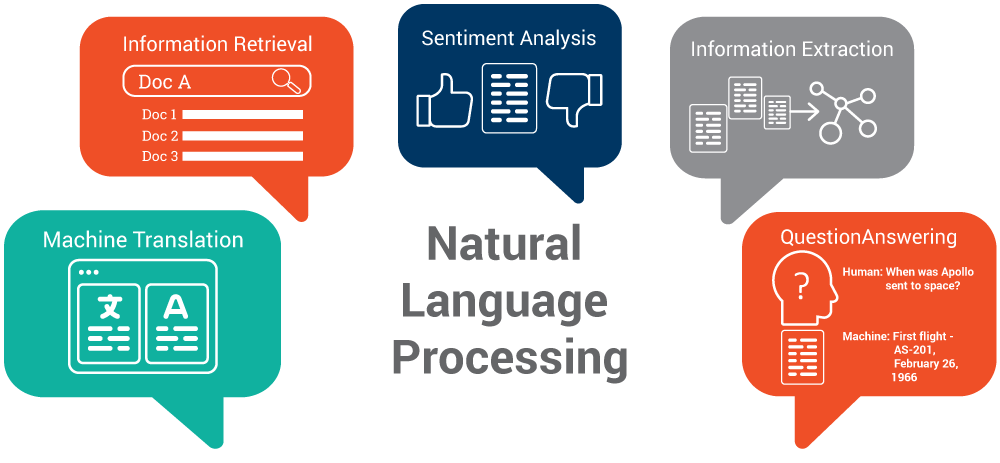
    

    <figcaption align="center">Figure 1: Picture showcasing a few use cases for NLP.</figcaption>
</figure>  
 
### Sentiment Analysis
Sentiment analysis is a subfield of NLP that concentrates on extracting the emotion in the human language, in other words it tries to identify whether the particular text carries a positive sentiment or a negative sentiment. Sentiment analysis plays a key role in today’s competitive world to quickly understand customers feeling and make decisions to secure the future business growth. Below are few critical uses case where sentiment analysis can help organizations.
1.	Upselling opportunities
2.	Live insights
3.	Tracking customer satisfaction
4.	Quick reaction to escalations
5.	Reduce customer churn
6.	Agent Monitoring
7.	Training chatbots
8.	Identifying emotional triggers

Shown in Figure 2 are the basic set of steps followed as part of sentiment analysis process. As part of pre-processing the text, we will convert the text to tokens, filter out the stop words that doesn’t add much value, identify and eliminate the words impacted by negation, followed by text stemming and lemmatization before feeding the words to classification models.  
In this project we have used pre-trained BERT models to perform sentiment analysis on IMDB movie reviews.
<figure>
    

        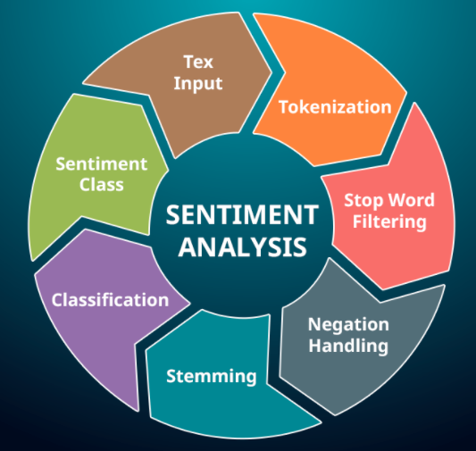
    

    <figcaption align="center">Figure 2: Picture showing the high-level flow of steps involved in sentiment analysis.</figcaption>
</figure>  
 

[back to top](#top)

### NLP Statistics
As shown in Figure 3, the footprint of NLP is expected to raise up to $29.5 Billion by 2025 at global market level at the growth rate of 20.5 % cumulative annual growth rate. We can also see the expectations around more use of sentiment analysis into the future.  
Also, from the pie chart shown in Figure 3, we can clearly see that NLP has already started contributing in several market segments. Banking and finance seem to be top contributor with the IT & Telecom industry to follow.  
<figure>
    

        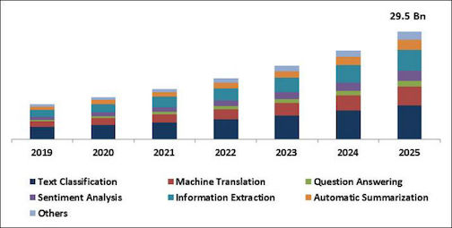
        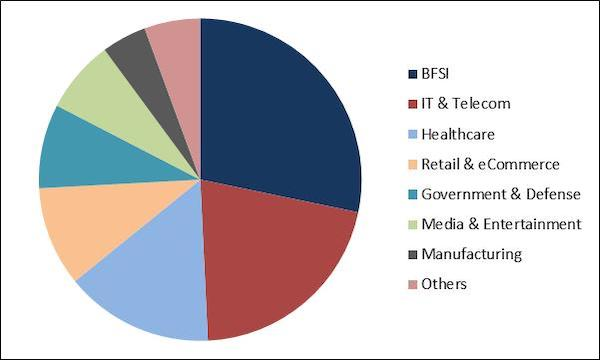
    

    <figcaption align="center">Figure 3: Chart showing the potential growth of Natural Language Processing as well as different sub-fields of NLP on the left, and the pie chart showing the distribution of NLP in different market segments.</figcaption>
</figure>  

[back to top](#top)

## Project Details
### Dataset Details
Dataset Link - <a href="https://www.kaggle.com/lakshmi25npathi/imdb-dataset-of-50k-movie-reviews" target="_blank">https://www.kaggle.com/lakshmi25npathi/imdb-dataset-of-50k-movie-reviews</a>    
- This dataset is the collection of 50,000 movie reviews captured from IMDB.
- This dataset has two columns, the text review about a movie, and the sentiment which is class for this project.
- Sentiment has two possible values either positive or negative, indicating a positive review or a negative one.
- This is a very balanced dataset, with 50% positive and 50% negative reviews.

[back to top](#top)

### Technology used
- Python 3
- Jupyter Notebook  

[back to top](#top)

### Exploratory Data Analysis
#### 1. IMDB dataset statistics
- As shown in Table 1, we have the total of 50,000 movie reviews and that very well balanced among the two classes we have in the dataset – positive and negative.

Table 1: Table with high level details about the IMDB movie reviews dataset.  
<table>
  <thead>
    <tr>
      <th> Parameter </th>
      <th> Value </th>
    </tr>
  </thead>
  <tbody>
    <tr>
      <td>Shape of the dataset</td>
      <td>(50000, 2)</td>
    </tr>
    <tr>
      <td>Total number of reviews</td>
      <td>50,000</td>
    </tr>
    <tr>
      <td>Number of positive reviews</td>
      <td>25,000</td>
    </tr>
    <tr>
      <td>Number of negative reviews</td>
      <td>25,000</td>
    </tr>
  </tbody>
</table>

[back to top](#top)

#### 2. Distribution of review length by sentiment
- Figure 4 shows a box plot with the distribution of number of words for review by sentiment type. We have not shown the outliers in this boxplot to reflect the % distributions clearly.  

<figure>
    

        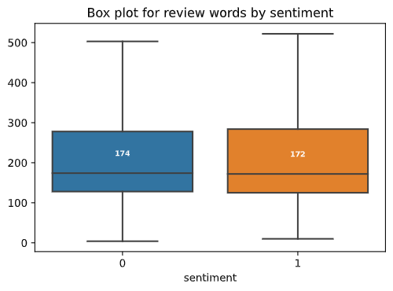
    

    <figcaption align="center">Figure 4: Box plot showing distribution of number of words per review by sentiment.</figcaption>
</figure>  

[back to top](#top)

Figure 5 below depicts the distribution of words by positive and negative sentiments. As we can see the distribution of review length (number of words) look similar to both positive and negative reviews. But the positive reviews seem to have some outliers expanding the max review length close to 2500 words.  
<figure>
    

        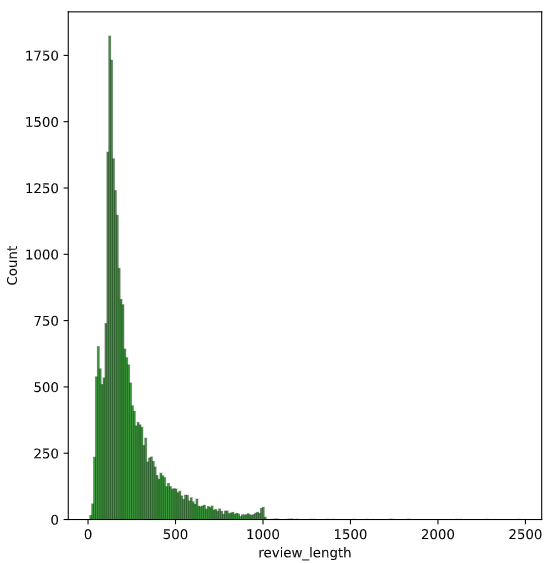
        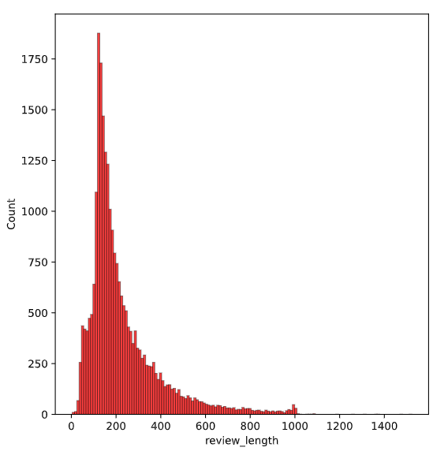
    

    <figcaption align="center">Figure 5: Distribution by number of words in review for positive sentiment on left, and negative sentiment on right.</figcaption>
</figure>   

Table 2 below shows the details about how the words are distributed within positive and negative reviews. It is interesting to see the smallest negative review is of only 4 words whereas the smallest positive review was of 10 words. We can notice the similar behavior even for the largest review.
Table 2: Table showing statistics for word counts by positive and negative sentiments.  
<table>
  <thead>
    <tr>
      <th> Parameter </th>
      <th> Postive Sentiment </th>
      <th> Negative Sentiment </th>
    </tr>
  </thead>
  <tbody>
    <tr>
      <td>Mean</td>
      <td>232.85</td>
      <td>299.46</td>
    </tr>
    <tr>
      <td>Median</td>
      <td>172</td>
      <td>174</td>
    </tr>
    <tr>
      <td>Minimum</td>
      <td>10</td>
      <td>4</td>
    </tr>
    <tr>
      <td>Maximum</td>
      <td>2470</td>
      <td>1522</td>
    </tr>
  </tbody>
</table>

[back to top](#top)

#### 3. Word Cloud plots
Figure 6 below depicts the WordCloud plots for both positive and negative reviews reflecting the popular words in each class. We have filtered some words like movie, film, and show through stop words to discover the truly interesting words. It seems like One is still a common word among both. We can clearly see several positive words on positive word cloud when compared to the negative word cloud as one can expect.   

<figure>
    

        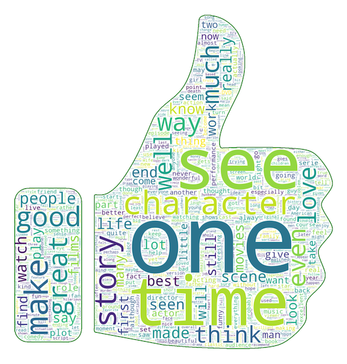
        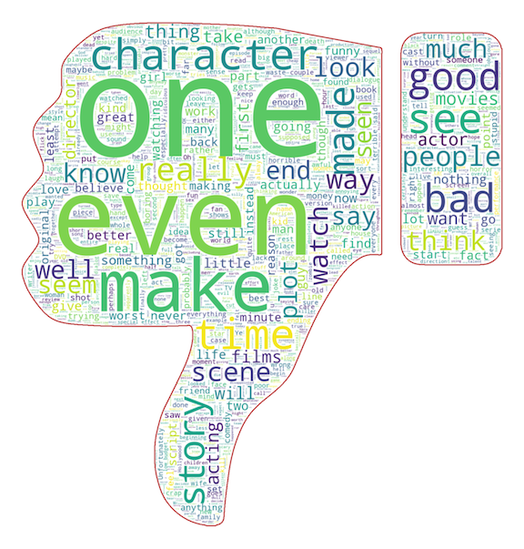
    

    <figcaption align="center">Figure 6: WordCloud plot for positive sentiment on the left and for the negative sentiment on the right.</figcaption>
</figure>  

[back to top](#top)

### Data Preparation
As established in EDA section, the dataset is perfectly balanced with 50% of records in each class. So, we have not done anything before feeding the data into the BERT text pre-processor model to convert input text reviews into the input format needed for BERT transformer models. BERT pre-processor model produces three outputs that are needed for subsequent models:  
1.	‘input_word_ids’ – this contains the token ids of the input sequence of words. BERT will also add special sequences as needed, mainly the CLS and SEP sequences.
2.	‘input_mask’ - To indicate the presence of input sequence within the fixed set of sequences (128 in this case).
3.	‘input_type_ids’ - This has index of the input segment that gave rise to the input token at the respective position.
As the BERT pre-processor model is the tensorflow model, we can use it directly as first layer in model definition.

[back to top](#top)

### Modeling
#### Model Details
We have built a simple multi-layer Keras model with BERT pre-processor model, BERT transformer model, one Drop and one Dense layer. Below are additional details about the model and its performance.
- As shown in Figure 7 below, we have total of 5 layers in the model including the input text layer.
<figure>
    

        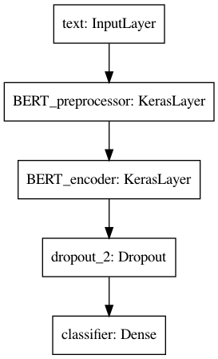
    

    <figcaption align="center">Figure 7: Keras model definition.</figcaption>
</figure>  
- We have used Adam optimizer to fine tune the model, and we have used binary cross loss function.
- We have trained the model for 5 Epochs; each Epoch has taken close to 2 hours for completing.
- We have evaluated the model using the loss and accuracy parameters from the history data returned from the model training, as well as by running the model evaluation using test data.
  
[back to top](#top)

#### Model Performance
- As shown in Table 3, model has achieved 87% accuracy in classifying the movie review.
Table 3: Model performance  
<table>
  <thead>
    <tr>
      <th> Evaluation Metric </th>
      <th> Value </th>
    </tr>
  </thead>
  <tbody>
    <tr>
      <td>Accuracy</td>
      <td>87%</td>
    </tr>
    <tr>
      <td>Loss</td>
      <td>34%</td>
    </tr>
  </tbody>
</table>
- Figure 8 depicts few sample texts and their scored generated by the new model.
<figure>
    

        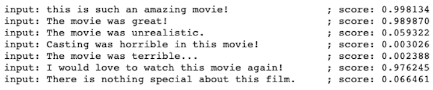
    

    <figcaption align="center">Figure 8: Sample review texts classified using the newly trained model.</figcaption>
</figure>  
- The accuracy and loss plots as show in Figure , reflect the overfitting problem as the validation loss doesn’t quite follow training loss.
<figure>
    

        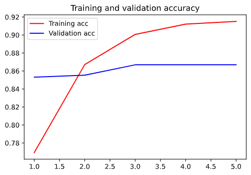
        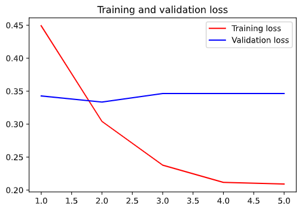
    

    <figcaption align="center">Figure 9: BERT Model Performance - accuracy and loss plots.</figcaption>
</figure>  
- Training the model with more Epochs could further improve the model performance.

[back to top](#top)

## Future scope
There has been a rapid growth in last couple of decades due to increase in availability of electronic data, reduction in cost for compute power, and the advent of internet. NLP has seen quite a bit of success already, but there is lot of scope for additional research and growth into the future to make NLP available to wide range of applications.  
With the advancements in the space of NLP and the technology overall, we now have capability to consume the real time data and then execute it through the NLP models to come up with insights about customer’s sentiment in real time helping businesses to take the customer engagement and satisfaction to the next level. Based on multiple references reviewed, NLP and sentiment analysis will play a key role in the future.  
There are several algorithm or modeling choices we can use for building NLP models like Naïve Bayes, Max Entropy, SVM, DNN, etc. But we believe the recent creation of BRET models is the next step in the evolution for NLP as these models come packed with lot of features and in several capacities making these models accessible to small scale applications with low compute powers as well.  

[back to top](#top)

## Acknowledgement
Thanks to Bellevue University and all professors for the continuous guidance and support through out the data science course. Thanks to Professor Fadi Alsaleem for providing continuous constructive feedback and peers for their valuable inputs and discussions that helped me in building this project.  
  
I also like to thank all the authors of the reference papers and articles.  

[back to top](#top)

## Conclusion
Natural Language Processing (NLP) helps machines to understand the text data that can come from many sources and is unstructured in nature. Great progress has been made in last few decades in NLP domain mainly because of increased computing capabilities, we see NLP being implemented in lot of applications around us through several smart home devices and chat bots.  
Sentiment analysis is an NLP technique that is used to determine the emotion attached to the textual data that generally represents the comments from humans. Sentiment analysis is playing a key role in several enterprises already by enabling the automation in the area of analyzing the customer reviews and feedbacks there by attaining the customer feedback much quicker and being able to make decisions for future products faster while meeting the customer demands.  
In this paper we have taken the IMDB reviews dataset that had 50,000 reviews and used it to train the Keras model with BERT pre-trained models. We have established that the BERT models have done a good job in classifying the movie review as positive or negative with 87% of accuracy score. We believe that allowing more time for training the model would yield even better classification outcomes.  

[back to top](#top)

## References
1.	Liddy, E.D. 2001. Natural Language Processing. In Encyclopedia of Library and Information Science, 2nd Ed. NY. Marcel Decker, Inc. Retrieved on 06/02 from https://surface.syr.edu/cgi/viewcontent.cgi?referer=https://scholar.google.com/&httpsredir=1&article=1019&context=cnlp
2.	Vishal A. Kharde, S.S. Sonawane, “Sentiment Analysis of Twitter Data: A Survey of Techniques” International Journal of Computer Applications (0975 – 8887) Volume 139 – No.11, April 2016. Retrieved from https://arxiv.org/pdf/1601.06971.pdf
3.	Prabowo, R., & Thelwall, M. (2009). Sentiment analysis: A combined approach. Journal of Informetrics, 3(2), 143-157. Retrieved from.
4.	Agarwal, A., Xie, B., Vovsha, I., Rambow, O., & Passonneau, R. J. (2011, June). Sentiment analysis of twitter data. In Proceedings of the workshop on language in social media (LSM 2011) (pp. 30-38). Retrieved on 06/02 from https://www.aclweb.org/anthology/W11-0705.pdf  
5.	Lin, C., & He, Y. (2009, November). Joint sentiment/topic model for sentiment analysis. In Proceedings of the 18th ACM conference on Information and knowledge management (pp. 375-384). Retrieved on 06/02 from https://citeseerx.ist.psu.edu/viewdoc/download?doi=10.1.1.163.5917&rep=rep1&type=pdf  
6.	Whitelaw, C., Garg, N., & Argamon, S. (2005, October). Using appraisal groups for sentiment analysis. In Proceedings of the 14th ACM international conference on Information and knowledge management (pp. 625-631). 
7.	Maas, A., Daly, R. E., Pham, P. T., Huang, D., Ng, A. Y., & Potts, C. (2011, June). Learning word vectors for sentiment analysis. In Proceedings of the 49th annual meeting of the association for computational linguistics: Human language technologies (pp. 142-150). Retrieved on 06/02 from https://www.aclweb.org/anthology/P11-1015.pdf.
8.	Hussein, D. M. E. D. M. (2018). A survey on sentiment analysis challenges. Journal of King Saud University-Engineering Sciences, 30(4), 330-338. Retrieved on 06/02 from https://www.sciencedirect.com/science/article/pii/S1018363916300071  
9.	IMDB Dataset of 50K Movie Reviews. Retrieved on 06/02 from https://www.kaggle.com/lakshmi25npathi/imdb-dataset-of-50k-movie-reviews 
10.	Overview about the sentiment analysis
        - Overview about sentiment analysis. Retrieved on 06/02 from https://monkeylearn.com/sentiment-analysis/ 
        - Use cases for sentiment analysis. Retrieved on 06/02 from https://www.whoson.com/customer-service/top-ten-benefits-of-sentiment-analysis/ 
11.	What is NLP and why is it important? Retrieved on 06/02 from https://www.analyticsinsight.net/what-is-nlp-and-why-is-it-important/
12.	Why Sentiment Analysis is the major game changer for patient care, by Spin-Strategy. Retrieved on 06/02 from https://www.spinanalyticsandstrategy.com/blog/why-sentiment-analysis-major-game-changer-for-patient-care/
13.	Top 5 Semantic Technology Trends to look for in 2017, by Milena Yankova January 2017. Retrieved on 06/02 from https://www.ontotext.com/blog/top-5-semantic-technology-trends-2017/ 
14.	Natural Language Processing Market Size, December 2019. Retrieved on 06/02 from https://www.kbvresearch.com/natural-language-processing-market/ 
15.	Top NLP Algorithms and concepts – Igor Bobriakov, December 2019. Retrieved on 06/02 from https://www.datasciencecentral.com/profiles/blogs/top-nlp-algorithms-amp-concepts

[back to top](#top)