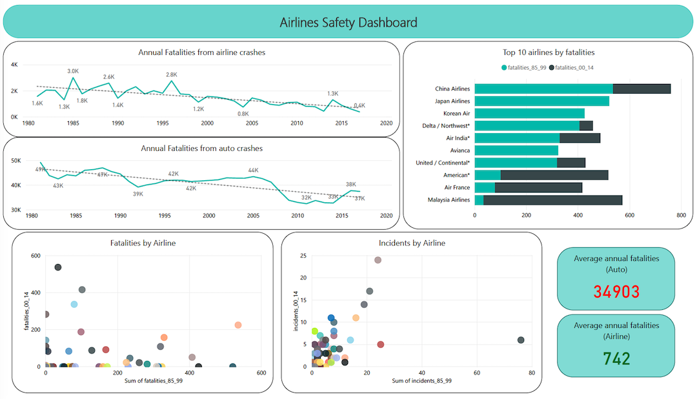

<h1 align="center">Air Travel Safety Analysis</h1>

  Chandramouli Yalamanchili  
   Updated - 06/04/2021 [Created - 03/28/2021]
   
  <a href="https://github.com/chandu85/data-science/tree/main/Project%204%20-%20Air%20Travel%20Safety" target="_blank">
    View Project on GitHub
  </a>

<figure>
    

</figure>  
 

## Introduction
Over the time there have been many technological advancements in aviation industry in affordability, monitoring, navigation, and maintenance. These technological advancements have made the air travel much safer and much affortable to the common man. There are close to `80 Million` passengers availing the air travel option per month as of January 2020, this huge number of passengers proves how sophisticated and safe air travel is overall.

In this post I would like to present different statistical data showing how much safer the air travel has become over the time, how does it compare to other means of travel with a goal to establish how safe the air travel is.  
[back to top](#top)

## Project Motivation
- To evaluate the concerns related to the mortality rate involved in air travel when compared other means of travel.
- Under the true picture of mortality rates for air travel when compared to other means.
- Understand how different countries and airlines are performing with respect to aviation safety.  
[back to top](#top)

## Data Background
1. Main data: Airline Safety.
2. Motor vehicle fatality rate in US.
3. TSA Data to get number of people travel within US.
4. Air traffic control data to get some insights into air traffic in US.  
[back to top](#top)

## Prerequisite
- Power BI  
[back to top](#top)

## Method Used
- Used PowerBI to extract different details from both airline safety as well as vehicle fatality rate datasets to come up with the comparison between airline safety when compared with other means of transportation.  
[back to top](#top)

## Potential Issues
- Extracting the required data was challenging as data is not uniform across several years. I have used data from last 20 years for comparison.  
[back to top](#top)

## Visualizations
#### 1. Dashboard
<figure>
    

        
    

    <figcaption align="center">Figure 1: Dashboard with air travel statistics</figcaption>
</figure>  

I have used PowerBI to build a visualization dashboard that includes below visualizations:  
1. Two Line charts - I have used two line charts, one for showing the trend of airline crash fatalities, and the 2nd one to show the trend of auto crash fatalities. Both of these trends are by year, using the historic data from source 4 mentioned above. I have used trend line to show the trend clearly.
2. One Stacked bar chart - I have used stacked bar chart to show the top 10 airlines based on the fatalities count, considering the total number of fatalities from 1985-2014.
3. Two Scatter plots - I have used scatter plots to show the relation between the fatalities before 2000 vs, fatalities after 2000, and fatal incidents before 2000 vs. fatal incidents after 2000. I have noticed that there is no correlation that can be established for fata incidents, which makes sense to some extent as each crash is different and can lead to different number of fatalities depending on conditions. But, we can establish come correlation between the fatal incidents themselves, so the airlines that had incidents before 2000 continued to have incidents in the recent years as well after 2000.
4. Two metric cards - These are used to reflect the average number of fatalities happened per year from auto crashes compared to the average number of fatalities happened per year from the airline crashes.  
[back to top](#top)

#### 2. Blogpost
I have create **<a href="https://chandu-dsc.blogspot.com/2020/10/is-it-safe-to-travel-by-air.html" target="_blank">Blog Post</a>()** to discuss the airline safety using the visual statistics.  
[back to top](#top)

#### 3. Infographic
I have used PPT template to put togehter the above infographic showing various statistics about air travel and then the comparison for number of fatalities in air travel with other means of travel.<figure>
    

        
    

    <figcaption align="center">Figure 2: Infographic for air travel safety</figcaption>
</figure>  

[back to top](#top)

#### 4. Other visualizations  
a. Airline Fatalities Trend - this visualization shows the trend of airline fatalities between 1985 & 2020.
<figure>
    

        
    

    <figcaption align="center">Figure 3: Airline fatalities trend from 1985</figcaption>
</figure>  
b. Comparison - This visual was prepared using PPT to compare the statistics collected from airtravel and road travel.
<figure>
    

        
    

    <figcaption align="center">Figure 4: Compare fatalities between airtravel and auto</figcaption>
</figure>  

[back to top](#top)

## Acknowledgement
Thanks to Bellevue University and all professors for the continuous guidance and support through out the data science course. Thanks to the peers for their valuable inputs and discussions that helped me in building this project.  
  
I also like to thank all the authors of the reference papers and articles.  
[back to top](#top)

## Conclusion
Aviation industry is highly sophisticated, very competitive and constantly evolving. We will be amazed if we think about the emerging and evolving innovations regarding comfort and safety in the airlines space. Ranging from evolving cockpit technology, constant flight status monitoring, passenger cabin safety measures, ultra modern communication through air traffic control and airport control, security checking and airport safety, - all work together to provide a better and safer travel experience. Considering all the aspects, air travel is arguably the safest means of travelling in the present era.  
[back to top](#top)

## References
Reference : Data Set
1. FiveThirtyEight, Airline Safety, Retrieved from https://github.com/fivethirtyeight/data/tree/master/airline-safety
2. Motor vehicle fatality rate in U.S. by year, Retrieved from https://en.wikipedia.org/wiki/Motor_vehicle_fatality_rate_in_U.S._by_year  
3. TSA traveller throughput, retrieved from https://www.tsa.gov/coronavirus/passenger-throughput
4. Air traffic by the numbers, retrieved from https://www.faa.gov/air_traffic/by_the_numbers/  
5. airline_fatalities.xlsx - Retrieved from http://www.baaa-acro.com/statistics/death-rate-per-year.
6. auto_Fatalities.XLS - Retrieved from https://cdan.nhtsa.gov/SASStoredProcess/guest.
7. Color blindness simulator - https://www.color-blindness.com/coblis-color-blindness-simulator/
[back to top](#top)
