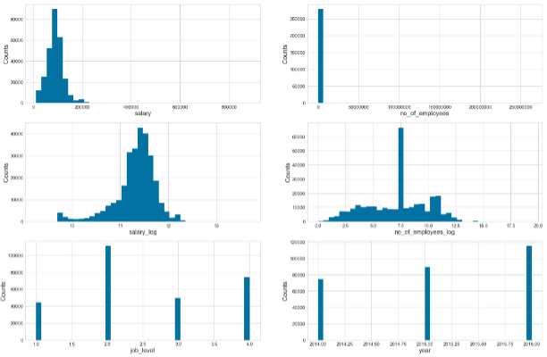
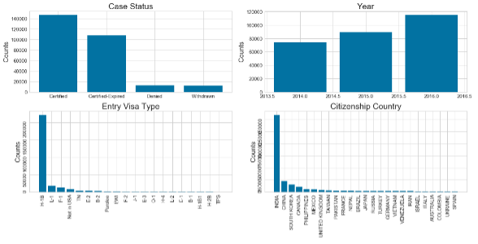
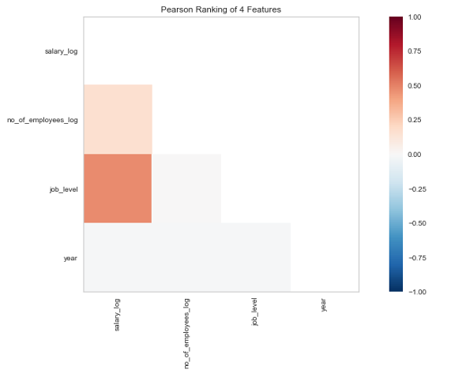
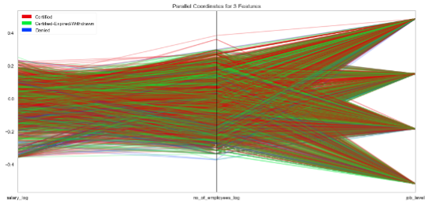
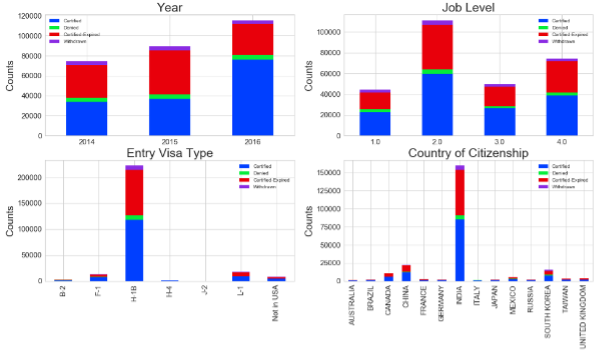
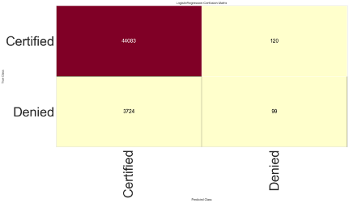
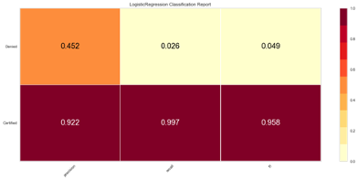
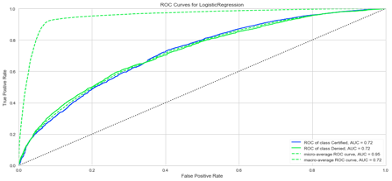

<h1 align="center">U.S Permanent Visa Approval Prediction</h1>

  Chandramouli Yalamanchili  
   Updated - 06/03/2021 [Created - 03/28/2021]
   
  <a href="https://github.com/chandu85/data-science/tree/main/Project%205%20-%20U.S%20Permanent%20Visa%20Approval%20Prediction/Code" target="_blank">
    View Project Code on GitHub
  </a>

<figure>
    

</figure>  
 

## Introduction
With ever changing immigration policies and minimum wage requirements the immigration work visa employees as well as employers are facing challenges due to uncertainity of visa extention approvals, especially considering the never ending permanent visa queue or wait for resources from few nations. Considering this situation, it is interesting to consider and research on how different attributes are impacting work visa applications for immigrant employees from different nations and different sectors.    
Through this project we have performed the analysis to identify different important factors that could impact the US permanent visa application. We have also built a logistic regression model to predict the approval of the US permanent visa application based on selected features.  

[back to top](#top)

## Project Motivation
- To understand how different variables/features impact the decision of the US permanent visa applications using different types of graph analysis techniques.
- To build a logistic regression model to try and predict the visa approval status based on selected input data features.  

[back to top](#top)

## Project Details
### Dataset Details
- Original dataset - <a href="https://www.kaggle.com/jboysen/us-perm-visas" target="_blank>https://www.kaggle.com/jboysen/us-perm-visas</a>.
- Modified the original dataset to come up with us_perm_visas_final.csv that is used in this project.
- Below are the features that are present in this dataset:
    - case_status - This is the status of the US Permanent visa application.
    - entry_visa – Type of visa that the candidate entered into USA with. 
    - citizenship - Country of citizenship of the candidate. 
    - no_of_employees - Number of employees under the employer who filed petition for the candidate.
    - state - USA state where employer is located.
    - job_level - Level of the job role, or expertise level of the candidate.
    - year - Year of the application decision.
    - salary - Salary offered to the candidate for the position.
- Below are some of the other variables present in the input dataset that I dropped for this project as I didn't see them fit.
    - employer_name
    - job_info_work_city
    - pw_job_title_9089
    - pw_soc_title
    - birth_country  

[back to top](#top)

### Technology used
- Python 3
- Jupyter Notebook  

[back to top](#top)

### Exploratory Data Analysis
I have applied several data cleaning steps as part of this project to be able to derive proper insights from it as well as to prepare it for modeling. Below I have documented different steps I have performed as part of data preperation as well as data analysis through graphs.  

#### 1. Data Overview
- To start with I have reviewed the data and identified the rows with missing values, below is the initial view of missing data by features.  
Table 1: Table showing the missing data by features.  
<table>
  <thead>
    <tr>
      <th> Feature/Column </th>
      <th> Count </th>
    </tr>
  </thead>
  <tbody>
    <tr>
      <td>case_number</td>
      <td>0</td>
    </tr>
    <tr>
      <td>case_status</td>
      <td>0</td>
    </tr>
    <tr>
      <td>class_of_admission</td>
      <td>25,845</td>
    </tr>
    <tr>
      <td>country_of_citizenship</td>
      <td>59</td>
    </tr>
    <tr>
      <td>decision_date</td>
      <td>0</td>
    </tr>
    <tr>
      <td>employer_name</td>
      <td>12</td>
    </tr>
    <tr>
      <td>employer_num_employees</td>
      <td>135,349</td>
    </tr>
    <tr>
      <td>employer_name.1</td>
      <td>12</td>
    </tr>
    <tr>
      <td>employer_state</td>
      <td>42</td>
    </tr>
    <tr>
      <td>foreign_worker_info_birth_country</td>
      <td>135,300</td>
    </tr>
    <tr>
      <td>job_info_work_city</td>
      <td>102</td>
    </tr>
    <tr>
      <td>job_info_work_state</td>
      <td>103</td>
    </tr>
    <tr>
      <td>pw_job_title_9089</td>
      <td>392</td>
    </tr>
    <tr>
      <td>pw_level_9089</td>
      <td>27,627</td>
    </tr>
    <tr>
      <td>pw_soc_title</td>
      <td>2,336</td>
    </tr>
    <tr>
      <td>pw_amount_9089</td>
      <td>2,216</td>
    </tr>
    <tr>
      <td>pw_unit_of_pay_9089</td>
      <td>1,572</td>
    </tr>
  </tbody>
</table>

[back to top](#top)

#### 2. Data cleanup needed for graph analysis  
I have performed below data clean up steps to extract the data in the format needed for graph analysis.
- Dropped the rows that have NA values in the columns - ‘class_of_admission’, 'country_of_citizenship', 'employer_state', and 'pw_unit_of_pay_9089'.
- Selected only few interested columns and dropped the rest of the columns. Also, renamed the column names.
- Field extraction - extracted salary field using two fields, pw_amount_9089 & pw_unit_of_pay_9089, I have extracted the yearly salary for all rows.
- Selected rows from years 2014, 2015 & 2016 years only to reduce the dataset size.
- Transformed job_level data from text into numeric by assigning unique value for each job level.
- At this point I had all of the selected rows, so I have done reset_index to reset the index on the dataframe.  
  
I have also modified the extracted feature values either to normalize them, or to fill missing values or to extract more meaningful value.  
- Filled the missing values using below steps:
        1.	No_of_employees - used the median to fill the missing values.
        2.	Job_level - used the most frequent value to fill the missing values.
- Value normalization - I have used log normalization to normalize the salary & no_of_employees features to remove the skewed data. 
- Year - derived the 4 digit year from the date.  

[back to top](#top)

#### 3. Graph Analysis - Histogram Plots
I plotted some histograms as showin Figure 1 to understand the data from different perspectives. Below are some of my observations from the histograms plotted.
- Salary - Due to normalization, the graph looks more distributed now, removing the left skewness I had earlier. I have left the picture from original analysis as well to show the difference. Based on the initial analysis, as can think most of the applications seems to be around $100,000, so I didn’t find any surprising findings here other than a small and interesting spike at $190,000.
- Number of employees - Due to normalization, the graph looks more distributed now, removing the left skewness I had earlier. I have left the picture from original analysis as well to show the difference. Based on the initial analysis, I was definitely not expecting more than 1000 companies having around 50,000 employees so that is an interesting finding.
- Job level - As H1B visa contributes to most of the permanent visa candidates that could be contributing here reflecting that level 4 candidates are more in number.
- Year - this one is pretty straight forward, we had increasing number of cases over last few years, so this is in line with what I was expecting to see.  

<figure>
    

        
    

    <figcaption align="center">Figure 1: Histogram charts including both raw and normalized values for salary & no_of_employees.</figcaption>
</figure>  

[back to top](#top)

#### 4. Graph Analysis - Bar charts
I have plotted bar charts using some of the other features, once again to gain understanding of the data from a different perspective. Below are my observations from the bar charts plotted.
- Case status - I was expecting to see more number of certified or approved cases, which we see in the below chart, but what surprised me was the certified-expired, I was not expecting to see so many of the expired cases.
- Year - As we have seen before with histogram, bar chart also shows increased number of cases by year.
- Entry visa type - once again, the chart here meets my expectations and proves my understanding to be correct. Most of the cases are H1B cases.
- Country - I knew India will be at the top of the list, but wasn’t expecting this much difference with other countries. This is an interesting finding for me.

<figure>
    

        
    

    <figcaption align="center">Figure 2: Bar charts for entry visa type, citizenship country, Case status, and Year.</figcaption>
</figure>  

[back to top](#top)

#### 5. Graph Analysis - Correlation matrix
I have used visualizer to find out the relationship between different features using Pearson ranking. Below are my observations:
- I see high correlation between salary and no_of_employees.
- Salary and year are positively related, that’s what we always hope in reality to have increased wages as the year changes.
- Salary and job level are positively related as well, which would make sense, a person with higher expertise would demand higher salary.
- All of the remaining parameters are negatively related.
- But, one of the thing surprised me was not having any strong relations between these fields.  

<figure>
    

        
    

    <figcaption align="center">Figure 3: Correlation between different features.</figcaption>
</figure>  

[back to top](#top)

#### 6. Graph Analysis - Parallel coordinates plot
I have compared several numeric parameters in the data using the parallel coordinates plot. 
- I did not get any meaningful or clear insights out of the parallel coordinates plot. Only thing we can see is with year, as the year increases we see stronger certified line and in the older years the number of certified-expired cases is high.
- As part of part 2, I removed the year and arrived at below graph shown in Figire 4 with normalized data for salary and no_of_employees.

<figure>
    

        
    

    <figcaption align="center">Figure 4: Parallel coordinates plot.</figcaption>
</figure>  

[back to top](#top)

#### 7. Graph Analysis - Stacked bar plots
I have compared various features using the stacked bar chart with respect to case status counts for each feature. Below are my observations out of this step.
- Year - It is interesting to see we have more approved cases in 2016 compared to 2015, by visual comparison.
- Job level - One more surprising fact, once again for me is to see those many expired cases.
- Entry visa - once again we can see H1B leading the chart at a very high margin from other types of visa.
- Country - India is leading the chart here and seeing a good number of approved cases for all countries.
- One common thing this chart clearly shows us is that most of the cases are getting approved, seems like very less cases are getting denied.  

<figure>
    

        
    

    <figcaption align="center">Figure 5: Stacked bar charts.</figcaption>
</figure>  

[back to top](#top)

### Data Preparation
I have taken below steps as part of data preperation to get the dataset ready for modeling:  
- I have converted few categorical features - entry_visa, citizenship, and state to numerical using one hot technique.
- I have also generated data_temp data frame that contains only the rows with either ‘certified’ or ‘denied’ rows as the primary goal for me is to identify if a particular case would be either certified or denied.
- I have combined the categorical variables converted to numbers with other features I have and generated the X and Y data frames needed for logistic regression model.
- I have also separated data frame into two sets, one for training the model and the other for testing the model. Below are the details from training and testing sets:
        - No. of samples in training set:  112060.
        - No. of samples in validation set: 48026.  

[back to top](#top)

### Modeling
#### Model Details
- I have created a logistic regression model and ran several evaluations on the model to see how the model is performing.

[back to top](#top)

#### Model Performance  
1. Confusion Matrix - As you can see below in Fugure 6, TP (True Positives) are high, but model failed to identify the denied cases accurately, only 99 cases (out of total 3823) denied cases were correctly predicted.

<figure>
    

        
    

    <figcaption align="center">Figure 6: Confusion Matrix.</figcaption>
</figure>  

2. Logistic regression classification report - Similar to what we have seen in confusion matrix, the other evaluation parameters show the poor performance of the model when it comes to denied class, as shown below in Figure 7.
<figure>
    

        
    

    <figcaption align="center">Figure 7: Logistic regression classification report.</figcaption>
</figure>  

3. ROC Curves - ROC curves show a better performance of the model as all of the curves are above the dotted line, which is randomly guessed.
<figure>
    

        
    

    <figcaption align="center">Figure 8: Logistic regression ROC Curves.</figcaption>
</figure>   

[back to top](#top)

## Acknowledgement
Thanks to Bellevue University and all professors for the continuous guidance and support through out the data science course. Thanks to Professor Fadi Alsaleem for providing continuous constructive feedback and peers for their valuable inputs and discussions that helped me in building this project.  
  
I also like to thank all the authors of the reference papers and articles.  

[back to top](#top)

## Conclusion
The graph analysis on the US permanent visa applications dataset has given me very good insight into the dataset, helped me in understanding this dataset in different perspective. It also helped me to realize some interesting facts. One of such fact being the very high number of approved, but expired cases. Also one good thing I see out of this analysis is that there are very less number of denials.  

Through this project, I have also learned that it is better to apply the normalization after we complete the graph analysis to understand the data and before we feed data into any models. I have also noticed that conversion of categorical features into numeric through one hot technique is probably not ideal when we have many possible values like in this case.	

And finally, I have built a logistic regression model to predict if a US permanent visa will be granted based on provided data or not. Overall the model I have built seems to be predicting the certified cases well, but predicting too many of the denied cases as certified as well. 
  
[back to top](#top)

## References
1.	US Permanent Visa Applications - Kaggle - https://www.kaggle.com/jboysen/us-perm-visas

[back to top](#top)
