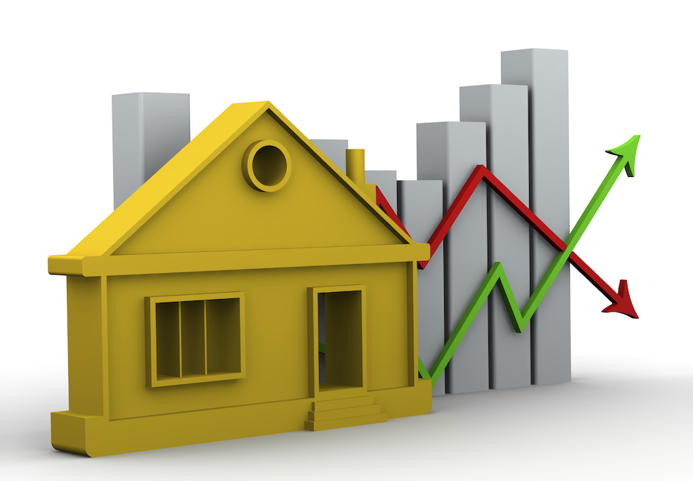

<h1 align="center">House Price Prediction</h1>

  Chandramouli Yalamanchili  
   Updated - 06/05/2021 [Created - 03/28/2021]
   
  <a href="https://github.com/chandu85/data-science/tree/main/Project%207%20-%20House%20Price%20Prediction" target="_blank">
    View Project Code on GitHub
  </a>

<figure>
    

</figure>  
 

## Introduction
The goal of this project is to build the linear regression model to house price prediction.   
[back to top](#top)

## Input Dataset
- <a href="https://www.kaggle.com/kamelyounes/house-prices-prediction/?select=train.csv" target="_blank">https://www.kaggle.com/kamelyounes/house-prices-prediction/?select=train.csv</a>
- I have pulled the home price data from Kaggle link provided above and used it for the project.  
[back to top](#top)

## Prerequisite
- Python 3 (or Anaconda distribution with Python 3)
- Jupyter notebook
- Python Packages needed
    - os
    - Pandas
    - Numpy
    - Seaborn
    - Matplotlib
    - imblearn
    - scikit-learn
    - pandas_profiling
    - xgboost 

[back to top](#top)

## Usage
- Download the dataset from the kaggle link provided above and place it in the path `Data/train.csv`
- Install all of the Python packages needed.
- Execute the jupyter notebook in the Jupyter server of choice.  
[back to top](#top)

## Method Used
- Used Python and Jupyter notebook for this project.
- Perform data analysis and summary functions to understand the distribution of the data as well as to identify the any missing values present in the data.
- Performed few data engineering steps to prepare the data for the modeling:
        - Handled the missing values, by replacing missing value to mean for numeric fields and to a constant of "Missing" for non-numeric fields.
        - One Hot encoding to make all non-numeric fields numeric as well.
        - Applied scaling to normalize the feature values.
- Created 3 types of regression models - linear regression, decision tree regression, and xgboost regression models.
- Compared all three trained models and it seems like xgboost has exhibited better performance with this data and for the amount of testing done.  
[back to top](#top)

## Conclusion
- Based on the regression scores, it seems like xgboost has performed better than the remaining two regression models.
    - Linear Regression - 0.74
    - Decision tree grid search - 0.74
    - XGBoost   - 0.88
- Also, the score on training set and testing set are very close indicating that there is no overfitting of the training data in the model.  
[back to top](#top)

## References
- <a href="https://www.kaggle.com/kamelyounes/house-prices-prediction#data" target="_blank">https://www.kaggle.com/kamelyounes/house-prices-prediction#data</a>  
[back to top](#top)

## Authors
- Chandramouli Yalamanchili  
[back to top](#top)

