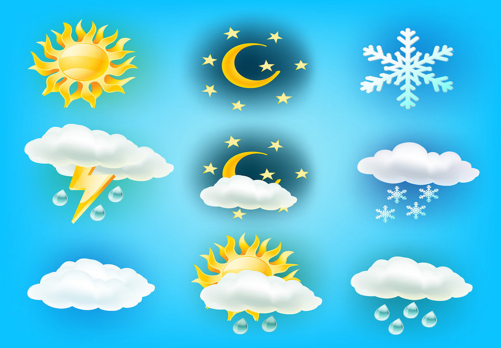

<h1 align="center">Weather API<</h1>

  Chandramouli Yalamanchili  
   Updated - 06/03/2021 [Created - 03/28/2021]
   
  <a href="https://github.com/chandu85/data-science/tree/main/Project%209%20-%20Weather%20API" target="_blank">
    View Project Code on GitHub
  </a>

<figure>
    

</figure>  
 

## Introduction
The goal of this project is to use Python requests package and pull data from internet and then parse the JSON payload to format the response back to end-user. Through this project, I have gained knowledge about making the web service calls in Python, I have also understood the code that is needed to be able to parse the JSON payload, which is the common message format used for RESTful APIs. This project has helped me to be prepared to write Python code needed to ingest the data from API services to consume data in real time.  
[back to top](#top)

## Input Dataset
N/A - Data is derived from webservice API depending on input parameters provided by the end user.   
[back to top](#top)

## Prerequisite
- Python 3 (or Anaconda distribution with Python 3)
- Python Packages needed
        - requests
        - datetime
- Registration with open weather API to be able to submit API request.  
[back to top](#top)

## Usage
- Create an account with openWeather website to get the API key that can be used for API calls.
- Install all of the Python packages needed.
- Execute the Python code on the terminal to start the interactive session to pull the data from open weather API.  
[back to top](#top)

## Method Used
- Used Python code for this project.
- Create code to accept either zip code or city name from user and then use the open weather API to retrieve the weather data for that city or zip.
- And finally, parse the JSON API response received from open weather service and print it back to user in an easily readable format.  
[back to top](#top)

## Authors
- Chandramouli Yalamanchili  
[back to top](#top)